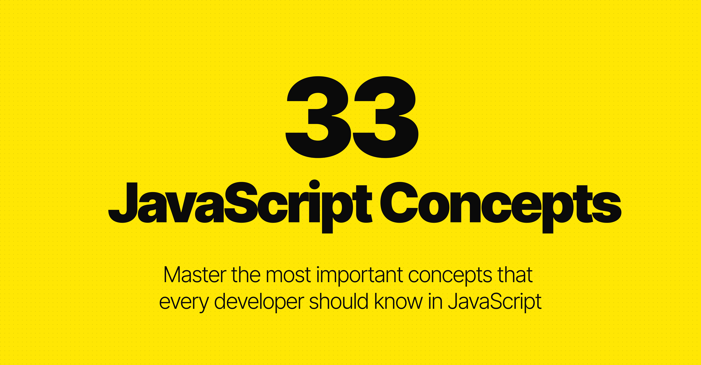

<h1 align="center">
 
  
   
   
  <strong>33 Concepts Every JavaScript Developer Should Know</strong>
    
</h1>

  

    <a href="#introduction">Introduction</a> •
    <a href="#community">Community</a> •
    <a href="#table-of-contents">Table of Contents</a> •
    <a href="#contributing">Contributing</a> •
    <a href="#license">License</a>
  

  <strong>🚀 Considered by GitHub as one of the <a href="https://blog.github.com/2018-12-13-new-open-source-projects/">top open source projects of 2018!</a></strong>

## 📖 <a id="introduction">Introduction</a>

This repository was created with the intention of helping developers master their concepts in JavaScript. It is not a requirement, but a guide for future studies. It is based on an article written by Stephen Curtis and you can read it [here](https://medium.com/@stephenthecurt/33-fundamentals-every-javascript-developer-should-know-13dd720a90d1).

## 🌍 <a id="community">Community</a>

Feel free to submit a PR by adding a link to your own recaps or reviews. If you want to translate the repo into your native language, please feel free to do so.

All the translations for this repo will be listed below:

- [اَلْعَرَبِيَّةُ‎ (Arabic)](https://github.com/amrsekilly/33-js-concepts) — Amr Elsekilly
- [Български (Bulgarian)](https://github.com/thewebmasterp/33-js-concepts) - thewebmasterp
- [汉语 (Chinese)](https://github.com/stephentian/33-js-concepts) — Re Tian
- [Português do Brasil (Brazilian Portuguese)](https://github.com/tiagoboeing/33-js-concepts) — Tiago Boeing
- [한국어 (Korean)](https://github.com/yjs03057/33-js-concepts.git) — Suin Lee
- [Español (Spanish)](https://github.com/adonismendozaperez/33-js-conceptos) — Adonis Mendoza
- [Türkçe (Turkish)](https://github.com/ilker0/33-js-concepts) — İlker Demir
- [русский язык (Russian)](https://github.com/gumennii/33-js-concepts) — Mihail Gumennii
- [Tiếng Việt (Vietnamese)](https://github.com/nguyentranchung/33-js-concepts) — Nguyễn Trần Chung
- [Polski (Polish)](https://github.com/lip3k/33-js-concepts) — Dawid Lipinski
- [فارسی (Persian)](https://github.com/majidalavizadeh/33-js-concepts) — Majid Alavizadeh
- [Bahasa Indonesia (Indonesian)](https://github.com/rijdz/33-js-concepts) — Rijdzuan Sampoerna
- [Français (French)](https://github.com/robinmetral/33-concepts-js) — Robin Métral
- [हिन्दी (Hindi)](https://github.com/vikaschauhan/33-js-concepts) — Vikas Chauhan
- [Ελληνικά (Greek)](https://github.com/DimitrisZx/33-js-concepts) — Dimitris Zarachanis
- [日本語 (Japanese)](https://github.com/oimo23/33-js-concepts) — oimo23
- [Deutsch (German)](https://github.com/burhannn/33-js-concepts) — burhannn
- [украї́нська мо́ва (Ukrainian)](https://github.com/AndrewSavetchuk/33-js-concepts-ukrainian-translation) — Andrew Savetchuk
- [සිංහල (Sinhala)](https://github.com/ududsha/33-js-concepts) — Udaya Shamendra
- [Italiano (Italian)](https://github.com/Donearm/33-js-concepts) — Gianluca Fiore
- [Latviešu (Latvian)](https://github.com/ANormalStick/33-js-concepts) - Jānis Īvāns
- [Afaan Oromoo (Oromo)](https://github.com/Amandagne/33-js-concepts) - Amanuel Dagnachew
- [ภาษาไทย (Thai)](https://github.com/ninearif/33-js-concepts) — Arif Waram
- [Català (Catalan)](https://github.com/marioestradaf/33-js-concepts) — Mario Estrada
- [Svenska (Swedish)](https://github.com/FenixHongell/33-js-concepts/) — Fenix Hongell
- [ខ្មែរ (Khmer)](https://github.com/Chhunneng/33-js-concepts) — Chrea Chanchhunneng
- [አማርኛ (Ethiopian)](https://github.com/hmhard/33-js-concepts) - Miniyahil Kebede(ምንያህል ከበደ)
- [Беларуская мова (Belarussian)](https://github.com/Yafimau/33-js-concepts) — Dzianis Yafimau
- [O'zbekcha (Uzbek)](https://github.com/smnv-shokh/33-js-concepts) — Shokhrukh Usmonov
- [Urdu (اردو)](https://github.com/sudoyasir/33-js-concepts) — Yasir Nawaz
- [हिन्दी (Hindi)](https://github.com/milostivyy/33-js-concepts) — Mahima Chauhan
- [বাংলা (Bengali)](https://github.com/Jisan-mia/33-js-concepts) — Jisan Mia
- [ગુજરાતી (Gujarati)](https://github.com/VatsalBhuva11/33-js-concepts) — Vatsal Bhuva
- [سنڌي (Sindhi)](https://github.com/Sunny-unik/33-js-concepts) — Sunny Gandhwani
- [भोजपुरी (Bhojpuri)](https://github.com/debnath003/33-js-concepts) — Pronay Debnath
- [ਪੰਜਾਬੀ (Punjabi)](https://github.com/Harshdev098/33-js-concepts) — Harsh Dev Pathak
- [Latin (Latin)](https://github.com/Harshdev098/33-js-concepts) — Harsh Dev Pathak
- [മലയാളം (Malayalam)](https://github.com/Stark-Akshay/33-js-concepts) — Akshay Manoj
- [Yorùbá (Yoruba)](https://github.com/ayobaj/33-js-concepts) - Ayomide Bajulaye
- [עברית‎ (Hebrew)](https://github.com/rafyzg/33-js-concepts) — Refael Yzgea
- [Nederlands (Dutch)](https://github.com/dlvisser/33-js-concepts) — Dave Visser
- [தமிழ் (Tamil)] (https://github.com/UdayaKrishnanM/33-js-concepts) - Udaya Krishnan M

## 📋 <a id="table-of-contents">Table of Contents</a>

Click to expand full table of contents

1. [**Call Stack**](#1-call-stack)
2. [**Primitive Types**](#2-primitive-types)
3. [**Value Types and Reference Types**](#3-value-types-and-reference-types)
4. [**Implicit, Explicit, Nominal, Structuring and Duck Typing**](#4-implicit-explicit-nominal-structuring-and-duck-typing)
5. [**== vs === vs typeof**](#5--vs--vs-typeof)
6. [**Function Scope, Block Scope and Lexical Scope**](#6-function-scope-block-scope-and-lexical-scope)
7. [**Expression vs Statement**](#7-expression-vs-statement)
8. [**IIFE, Modules and Namespaces**](#8-iife-modules-and-namespaces)
9. [**Message Queue and Event Loop**](#9-message-queue-and-event-loop)
10. [**setTimeout, setInterval and requestAnimationFrame**](#10-settimeout-setinterval-and-requestanimationframe)
11. [**JavaScript Engines**](#11-javascript-engines)
12. [**Bitwise Operators, Type Arrays and Array Buffers**](#12-bitwise-operators-type-arrays-and-array-buffers)
13. [**DOM and Layout Trees**](#13-dom-and-layout-trees)
14. [**Factories and Classes**](#14-factories-and-classes)
15. [**this, call, apply and bind**](#15-this-call-apply-and-bind)
16. [**new, Constructor, instanceof and Instances**](#16-new-constructor-instanceof-and-instances)
17. [**Prototype Inheritance and Prototype Chain**](#17-prototype-inheritance-and-prototype-chain)
18. [**Object.create and Object.assign**](#18-objectcreate-and-objectassign)
19. [**map, reduce, filter**](#19-map-reduce-filter)
20. [**Pure Functions, Side Effects, State Mutation and Event Propagation**](#20-pure-functions-side-effects-state-mutation-and-event-propagation)
21. [**Closures**](#21-closures)
22. [**High Order Functions**](#22-high-order-functions)
23. [**Recursion**](#23-recursion)
24. [**Collections and Generators**](#24-collections-and-generators)
25. [**Promises**](#25-promises)
26. [**async/await**](#26-asyncawait)
27. [**Data Structures**](#27-data-structures)
28. [**Expensive Operation and Big O Notation**](#28-expensive-operation-and-big-o-notation)
29. [**Algorithms**](#29-algorithms)
30. [**Inheritance, Polymorphism and Code Reuse**](#30-inheritance-polymorphism-and-code-reuse)
31. [**Design Patterns**](#31-design-patterns)
32. [**Partial Applications, Currying, Compose and Pipe**](#32-partial-applications-currying-compose-and-pipe)
33. [**Clean Code**](#33-clean-code)

## 👥 <a id="contributing">Contributing</a>

We welcome contributions! Please feel free to submit a Pull Request. For major changes, please open an issue first to discuss what you would like to change.

## 📄 <a id="license">License</a>

This project is licensed under the MIT License - see the [LICENSE](LICENSE) file for details.

---

  <strong>Happy Learning! ⭐</strong>
  
If you find this repository helpful, please consider giving it a star!

  
  

