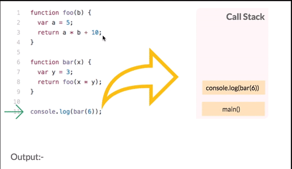
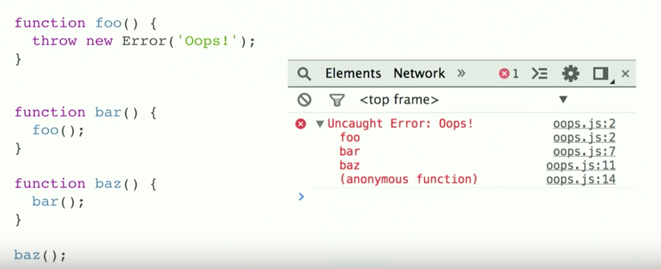
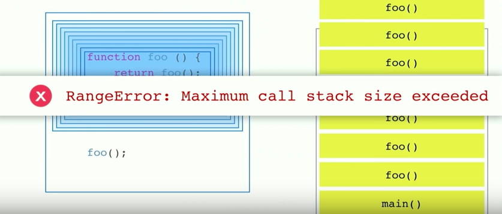

```

```

2019-04-17-Understanding Javascript Call Stack, Event Loops — Gaurav Pandvia

Understanding Javascript Function Executions — Call Stack, Event Loop , Tasks & more

자바스크립트 함수 동작에 대한 이해 - 콜-스택 , 이벤트 루트, 타스크 앤 모얼

Web developers or Front end engineers, as that’s what we like to be called, nowadays do everything right from acting as a source of interactivity inside the browser to making computer games, desktop widgets, cross-platform mobile apps or writing it on server side (most popularly with node.js) to connect it with any database — achieving near-ubiquity as a scripting language.

오늘날 웹개발자와 프론트 개발자 들은 오늘날 스크립팅 언어로 많은 부분을 관여한다.

It is therefore important to get to know about the internals of Javascript, to use it better and effectively and this is what the article is about.

그러므로 자바스크립트의 내부에 대해서 아는 것은 중요하다. 더 잘 사용하고 효율적이게 만들어주기 위해서, 그것이 이 기사의 목적.

The Javascript ecosystem has become more complicated than ever and will continue to become more.

자바스크립트 생태계는 점점 더 복잡하게 되었고 앞으로도 계속 심해질 것이다.

The tooling that is required to build a modern web app is overwhelming with Webpack, Babel, ESLint, Mocha, Karma, Grunt…etc, etc — what should I use and which tool is doing what? I found this web comic, which perfectly illustrates the struggle of today’s web developers.
모던 웹 앱을 빌드하는 데 사용되는 도구들은 넘쳐나고 있다. 웹팩, 바벨, ESLint 등등...

```
All this apart, what every Javascript developer first needs to do before diving deep into using any framework or library out there in the fish market is to know the basic foundation of how all of this is done internally at the root level.

이 모든 것이 자바스크립트 개발자들이 프레임워크나 라이브러리를 사용하기 전에 루트 레벨에서 어떤 기초가 근간이 되어야하는지를 알 수 있다. ?
```

Mostly all JS dev might have heard the term V8, chrome’s Runtime but some might even didn’t really know what that meant, what that did.
v8 을 들어는 봤지만 걔들이 뭘 하는지는 잘 모를거다.

I initially for the first year of my professional career as a developer, didn’t know much about all these fancy terms either as it was more about getting the work complete first.
나는 처음에 개발자로서 프로 생활을 시작한 첫 해 동안, 이 모든 화려한 용어들에 대해 잘 알지 못했다. 왜냐하면 그것이 먼저 일을 완성시키는 것에 더 중요했기 때문이다.

That didn’t satiate my curiosity about how the hell Javascript is able to do all this stuff.
도대체 자바스크립트가 어떻게 이 모든 것들을 할 수 있는지에 대한 나의 호기심을 충족시키지는 못했다.

I decided to dig deep, rummaging around google and came across few good blog posts including this Philip Roberts, a great talk at JSConf on the event loop and so I decided to summarize my learning and share it.
열심히 공부한걸 여기 공유하겠따.

As there are plenty of things to know about, I have divided the article into 2 parts. This part will introduce the terms that are commonly used and in the second part the linking between all those.

알아야하는 것이 아주 많지만, 두 부분을 로 나누어서 먼저 각 용어를 설명하고 나서 모든것들을 연관지어서 설명하겠다.

Javascript is a single threaded single concurrent language, meaning it can handle one task at a time or a piece of code at a time.
자바스크립트는 싱글 스레드, 싱글 동시성 언어다. 뜻은 한번에 한개의 타스크와 코드 한조각을 다룬다는 뜻.

It has a single call stack which along with other parts like heap, queue constitutes the Javascript Concurrency Model (implemented inside of V8).
싱글 콜스택은 v8 엔진 안쪽에 구현된 콜 스택이라고 하는 힙과 큐로 구성된 자바의 동시성 모델이다.

Let us first go through each of these terminologies :


1.Call Stack :- It’s a data structure which records the function calls, basically where in the program we are.
If we call a function to execute , we push something on to the stack, and when we return from a function, we pop off the top of the stack.

함수가 실행이 되면 스택에 어떤것을 밀어넣고, 함수로 부터 리턴값을 받으면 스택에서 하나씩 꺼낸다.



As we run the above file, we first look for the main function where all the execution will start.
파일을 실행 시키면, 제일 먼저 실행할 함수를 찾는다.

In the above, it starts from console.log(bar(6)), which is pushed on to the stack, next frame on top of it is the function bar with it’s arguments which in turn calls function foo which is again pushed on to the top of stack and it returns immediately and so is popped out of stack, similarly bar is then popped out and finally console statement is popped out printing the output.

All this happens in jiffy (in ms) one at a time.

You all must have seen the long red error stack trace sometimes in our browser console, that basically indicates the current state of the call stack and where in the function it failed in a top to bottom manner just like stack (see image below)

여러분 모두는 때때로 브라우저 콘솔에서 긴 빨간색 오류 스택 추적을 보았을 것이다. 이는 기본적으로 콜 스택의 현재 상태와 스택과 같은 상위에서 하위까지 기능에서 실패했음을 나타낸다(아래 이미지 참조).



Sometimes, we get into an infinite loop as we call a function multiple times recursively and as for Chrome browser, there is a limit on the size of the stack which is 16,000 frames , more than that it will just kill things for you and throw Max Stack Error Reached (image below).

최대 스택은 16000 프레임이다. 크롬 브라우저.



2.Heap :- Objects are allocated in a heap i.e mostly unstructured region of memory. All the memory allocation to variables and objects happens here.
객체가 할당된다 힙 안에, 비정형 메모리. 변수와 개체에 대한 모든 메모리 할당은 여기서 이루어진다.

3.Queue :- A JavaScript runtime contains a message queue, which is a list of messages to be processed and the associated callback functions to execute.
JavaScript 런타임은 처리할 메시지의 목록과 실행할 관련 콜백 기능을 포함하는 메시지 큐를 포함한다.

When the stack has enough capacity, a message is taken out of the queue and processed which consists of calling the associated function (and thus creating an initial stack frame).
스택의 용량이 충분하면, 큐에서 메시지를 꺼내서 관련 기능을 호출(따라서 초기 스택 프레임을 생성)하여 처리한다.

The message processing ends when the stack becomes empty again.

In basic words , these messages are queued in response to external async events(such as a mouse being clicked or receiving the response to an HTTP request), given a callback function has been provided.

If, for example a user were to click a button and no callback function was provided — no message would have been enqueued.

스택이 다시 비워지면 메시지 처리가 종료된다.
기본적인 말로, 콜백 기능이 제공된 경우, 이러한 메시지는 외부 비동기 이벤트(클릭되는 마우스나 HTTP 요청에 대한 응답을 수신하는 등)에 대한 응답으로 대기되어 있다.
예를 들어 사용자가 버튼을 클릭할 때 콜백 기능이 제공되지 않았다면 어떤 메시지도 입력되지 않았을 것이다.

Event Loop

Basically, when we evaluate the performance of our JS code, so a function in a stack makes it slow or fast, console.log() will be fast but performing iteration with for or while over thousands or millions of line items will be slower, and will keep the stack occupied or blocked. This is termed as blocking script, which you have read or heard about in Webpage Speed Insights.

Network requests can be slow, the image requests can be slow, but thankfully the server requests can be done through AJAX, an asynchronous function.

If suppose, these network requests are made through synchronous functions, then what would happen?

The network requests are send to some server, which is basically another computer/machine somewhere.

Now, computers can be slow sending back the response.

In the meantime , if I click some CTA button, or some other rendering needs to be done, nothing will happen as the stack is blocked.

In multi threaded language like Ruby, it can be handled, but in single threaded language like Javascript, this is not possible unless function inside the stack returns a value.

The webpage will hell breaks loose as the browser can’t do anything.

This is not ideal if we want fluid UI for the end user. How do we handle this?

The easiest solution is by using asynchronous callbacks, which means that we run some part of code and give it a callback (function) which will execute later.

We all must have encounter asynchronous callbacks like any AJAX request using \$.get(),setTimeout(),setInterval(), Promises, etc.

Node is all about asynchronous function execution.
All these async callbacks doesn’t run immediately and are going to run some time later, so can’t be pushed immediately inside the stack unlike synchronous functions like console.log(), mathematical operations.

Where the hell then they go and how they are handled?


If we see a network request in action in Javascript like in above code:

The request function is executed, passing an anonymous function in onreadystatechange event as a callback to execute when a response is available sometime in the future.

“Script call done!” is immediately output to the console
Sometime in the future, the response comes back and our callback is executed, outputting its body to the console.

요청 기능을 실행하고, 향후에 응답이 가능할 때 실행하기 위한 콜백으로 온레디스테이트 교환 이벤트에서 익명 기능을 전달한다.

"스크립트 호출 완료!"를 콘솔로 즉시 출력
언젠가, 반응이 돌아오고 우리의 콜백이 실행되어 콘솔로 몸을 출력한다.

The decoupling of the caller from the response allows for the JavaScript runtime to do other things while waiting for your asynchronous operation to complete and their callbacks to fire.
비동기 명령이 완료되어서 콜백이 발사되기를 기다리는 동안 자바스크립트 런타임은 콜러의 응답으로부터 복제된다.
다시 ㄱㄱㅇㅇ

2This is where browser APIs kicks in and call its APIs, which are basically threads created by browser implemented in C++ to handle async events like DOM events, http request, setTimeout, etc.(After knowing this, in Angular 2, Zones are used which monkey patches these APIs to cause runtime change detection, which I can get a picture now, how they were able to achieve it.)

Browser Web APIs- threads created by browser implemented in C++ to handle async events like DOM events, http request, setTimeout, etc.
Now these WebAPIs can’t themselves put the execution code on to the stack, if it did, then it would randomly appear in the middle of your code. The message callback queue discussed above shows the way. 3Any of the WebAPI pushes the callback onto this queue when it’s done executing. The Event Loop now is responsible for the execution of these callbacks in the queue and pushing it in the stack, when it is empty 4. Event loop basic job is to look both at the stack and the task queue, pushing the first thing on the queue to the stack when it see stack as empty. Each message or callback is processed completely before any other message is processed.
