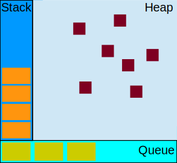
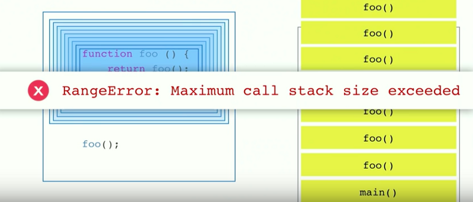

# 자바스크립트 - 콜스택, 이벤트 루프, 태스크 등에 대한 이해

오늘날의 웹 개발자나 프론트엔드 개발자는 게임, 데스크톱 위젯, 크로스 플랫폼 모바일앱, 서버사이드(가장 보편적인 node.js로 대표되는)까지 브라우저 내에서 상호작용하는 소스로 많은 역할을 수행한다. 
이렇게 자바스크립트를 사용함에 있어 더 효율적으로, 잘 사용하려면 내부 구조를 하는 것이 매우 중요하며, 바로 이것이 이 글에 대한 것이다.

자바스크립트 생태계는 매우 복잡해져 왔으며, 점점 더 그렇게 되가고 있다. 모던 웹앱을 구현함에 있어 필요한 툴들은 Webpack, Babel, ESLint, Mocha, Karma, Grunt 등.. 매우 방대하다.
모든 자바스크립트 개발자가 어떠한 프레임워크나 라이브러리를 공부하기 전 알아야 할 것은 이 모든 것이 루트레벨에서 내부적으로 어떻게 실행되는지에 대한, 기본적인 기반 지식이다.
대부분의 자바스크립트 개발자들은 크롬 런타임인 V8이라는 용어를 들었겠지만, 일부는 그 의미가 무엇이며 어떤 것을 수행하는지 몰랐을지도 모른다.
나는 깊이 파고 들기로 결심했고, 구글링하여 [Philip Roberts](https://twitter.com/philip_roberts)의 좋은 블로그 글 몇개를 발견할 수 있었다. 그는 [JSConf](https://www.youtube.com/user/jsconfeu)에서 [이벤트 루프에 대하여 훌륭한 강연](https://www.youtube.com/watch?v=8aGhZQkoFbQ)을 선보였던 사람이다.

자바스크립트는 싱글 쓰레드의 싱글 컨커런트 언어이다. 이는 동시에 하나의 작업이나 하나의 코드 조각만 실행할 수 있다는 것을 의미한다. 하나의 콜 스택을 가지며, 스택은 힙, 큐와 함께 V8엔진 내부에서 실행하는 자바스크립트 동시성 모델(Concurrency Model)을 구성한다.

1. 콜 스택(Call Stack)
함수 호출을 기록하는 데이터 구조이다. 기본적으로 프로그램에서 어디를 실행하고 있냐라고 할 수 있다. 함수를 호출하면, 스택에 무언가를 집어넣게 되고, 함수로부터 리턴을 받으면, 스택의 맨 위에서 빠져나오게 된다.

브라우저 콘솔에서 에러가 났을때 빨간색의 에러 메시지를 보여주는 것을 봤을 것이다.
여기서 각 스택 단계별로 상위 호출부를 추적하여 보여주게 된다. 바로 이것이 기본적으로 콜 스택에서 현재 상태를 보여주는 것이라 할 수 있다. (아래 그림 참고)

함수를 재귀적으로 여러번 호출할 때 무한 루프가 발생하며, 크롬 브라우저의 경우에는 스택의 크기가 16,000 프레임으로 제한된다. 그 이상의 스택은 죽이게 되며 'Max Stack Error'가 발생된다. (아래 그림 참고)

2. 힙(Heap)
객체는 힙, 즉 대부분 구조화 되지 않은 메모리 영역에 할당된다. 변수와 객체에 대한 모든 메모리 할당은 여기에서 발생한다.

3. 큐(Queue)
자바스크립트 런타임은 메시지 큐를 포함한다. 메시지 큐는 처리할 메시지와 실행할 관련 콜백 함수의 목록이다.
스택이 충분한 허용 용량을 가지고 있을때, 큐로부터 메시지를 가져와 관련 함수를 호출하여 처리된다. (이렇게 초기 스택 프레임을 만든다.)

스택이 다시 비게 되면 메시지 처리는 종료된다. 
기본적으로 이러한 메시지들은 콜백 함수가 제공되는 경우 외부 비동기 이벤트(예: 마우스 클릭 또는 HTTP 요청에 대한 응답 수신)에 대한 응답으로 큐에 대기하게 된다.
예를 들어 사용자가 버튼을 클릭할 때 콜백 함수가 제공되지 않는다면 아무런 메시지도 큐에 추가되지 않았을 것이다.

## 이벤트 루프(Event Loop)

## Index

 * 📜 [자바스크립트 - 콜스택, 이벤트 루프, 태스크 등에 대한 이해](./posts/1. call stack - 1) 자바스크립트 - 콜스택, 이벤트 루프, 태스크 등에 대한 이해.md)
 * Reference: https://medium.com/@gaurav.pandvia/understanding-javascript-function-executions-tasks-event-loop-call-stack-more-part-1-5683dea1f5ec
 * Original Repository: https://github.com/leonardomso/33-js-concepts/blob/master/README.md

 **[⬆ Back to Top](https://github.com/biyott/33-js-concepts#1-call-stack)**
 
 ** 후기: Vscode에서 쓰다가 디렉토리 이름을 변경했는데 갑자기 글 내용이 다 날라갔네요. 매우 슬픕니다 ㅠㅜ
