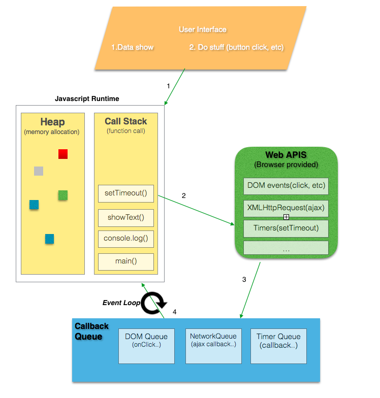

# 자바스크립트 - 콜스택, 이벤트 루프, 태스크 등에 대한 이해

오늘날의 웹 개발자나 프론트엔드 개발자는 게임, 데스크톱 위젯, 크로스 플랫폼 모바일앱, 서버사이드(가장 보편적인 node.js로 대표되는)까지 브라우저 내에서 상호작용하는 소스로 많은 역할을 수행한다. 
이렇게 자바스크립트를 사용함에 있어 더 효율적으로, 잘 사용하려면 내부 구조를 하는 것이 매우 중요하며, 바로 이것이 이 글에 대한 것이다.

자바스크립트 생태계는 매우 복잡해져 왔으며, 점점 더 그렇게 되가고 있다. 모던 웹앱을 구현함에 있어 필요한 툴들은 Webpack, Babel, ESLint, Mocha, Karma, Grunt 등.. 매우 방대하다.
모든 자바스크립트 개발자가 어떠한 프레임워크나 라이브러리를 공부하기 전 알아야 할 것은 이 모든 것이 루트레벨에서 내부적으로 어떻게 실행되는지에 대한, 기본적인 기반 지식이다.
대부분의 자바스크립트 개발자들은 크롬 런타임인 V8이라는 용어를 들었겠지만, 일부는 그 의미가 무엇이며 어떤 것을 수행하는지 몰랐을지도 모른다.
나는 깊이 파고 들기로 결심했고, 구글링하여 [Philip Roberts](https://twitter.com/philip_roberts)의 좋은 블로그 글 몇개를 발견할 수 있었다. 그는 [JSConf](https://www.youtube.com/user/jsconfeu)에서 [이벤트 루프에 대하여 훌륭한 강연](https://www.youtube.com/watch?v=8aGhZQkoFbQ)을 선보였던 사람이다.

자바스크립트는 싱글 쓰레드의 싱글 컨커런트 언어이다. 이는 동시에 하나의 작업이나 하나의 코드 조각만 실행할 수 있다는 것을 의미한다. 하나의 콜 스택을 가지며, 스택은 힙, 큐와 함께 V8엔진 내부에서 실행하는 자바스크립트 동시성 모델(Concurrency Model)을 구성한다.


1. 콜 스택(Call Stack)
함수 호출을 기록하는 데이터 구조이다. 기본적으로 프로그램에서 어디를 실행하고 있냐라고 할 수 있다. 함수를 호출하면, 스택에 무언가를 집어넣게 되고, 함수로부터 리턴을 받으면, 스택의 맨 위에서 빠져나오게 된다.

브라우저 콘솔에서 에러가 났을때 빨간색의 에러 메시지를 보여주는 것을 봤을 것이다.
여기서 각 스택 단계별로 상위 호출부를 추적하여 보여주게 된다. 바로 이것이 기본적으로 콜 스택에서 현재 상태를 보여주는 것이라 할 수 있다. (아래 그림 참고)


함수를 재귀적으로 여러번 호출할 때 무한 루프가 발생하며, 크롬 브라우저의 경우에는 스택의 크기가 16,000 프레임으로 제한된다. 그 이상의 스택은 죽이게 되며 'Max Stack Error'가 발생된다. (아래 그림 참고)


2. 힙(Heap)
객체는 힙, 즉 대부분 구조화 되지 않은 메모리 영역에 할당된다. 변수와 객체에 대한 모든 메모리 할당은 여기에서 발생한다.

3. 큐(Queue)
자바스크립트 런타임은 메시지 큐를 포함한다. 메시지 큐는 처리할 메시지와 실행할 관련 콜백 함수의 목록이다.
스택이 충분한 허용 용량을 가지고 있을때, 큐로부터 메시지를 가져와 관련 함수를 호출하여 처리된다. (이렇게 초기 스택 프레임을 만든다.)

스택이 다시 비게 되면 메시지 처리는 종료된다. 
기본적으로 이러한 메시지들은 콜백 함수가 제공되는 경우 외부 비동기 이벤트(예: 마우스 클릭 또는 HTTP 요청에 대한 응답 수신)에 대한 응답으로 큐에 대기하게 된다.
예를 들어 사용자가 버튼을 클릭할 때 콜백 함수가 제공되지 않는다면 아무런 메시지도 큐에 추가되지 않았을 것이다.

## 이벤트 루프(Event Loop)

기본적으로 JS 코드의 성능을 평가할 때 스택의 함수가 성능을 느리거나 빠르게 만들 수 있으므로,
console.log()는 빠르겠지만 for나 while로 수천 또는 수백만 라인의 항목을 수행하는 반복문은 느려질 것이며, 스택을 점유하거나 블러킹할 것이다.
이것은 블로킹 스크립트(blocking script)로 불리우며, 당신은 웹페이지 스피드 인사이트(Webpage Speed Insights)에서 그에 대해 읽어나 들었을 것이다.

네트워크 요청은 느려질 수 있고 이미지 요처도 느려질 수 있다. 하지만 고맙게도 서버 요청은 비동기 함수인 AJAX를 통해 수행될 수 있다. 이 네트워크 요청이 동기 함수를 통해 만들어진다 가정할때 어떤 일이 발생할까? 
네트워크 요청은 기본적으로 어딘가에 있는 다른 서버로 발송이 된다. 이제 컴퓨터는 응답을 느리게 되돌릴 수 있다. 그 동안에, 만약 CTA 버튼(Call to Action - 고객에 행동을 유도하는 버튼)을 클릭하거나 어떠한 다른 렌더링이 행해질 필요가 있다면, 스택이 블럭되어 아무 일도 일어나지 않을 것이다. 루비 같은 멀티 쓰레드 언어에서는 처리가 가능하지만, 자바스크립트 같은 싱글 쓰레드 언어에서는 스택 내부에서 함수가 값을 리턴하지 않는 한 처리할 수 없다. 브라우저가 아무 것도 할 수 없으므로 웹페이지는 응답하지 않을 것이다. 엔드 유저를 위한 유동적인 UI가 필요한 경우 이상적이지 않다. 이것을 어떻게 처리해야 할 것인가?

* 자바스크립트의 동시성(Concurrency) - 비동기 콜백(Async Callbacks)을 제외하고 한번에 하나만 처리함

가장 쉬운 해답은 비동기 콜백을 사용하는 것으로 처리하는 것이다. 즉, 우리는 코드의 일부분을 수행하고 나중에 실행할 콜백 함수를 제공한다. 우리 모두는 $.get(), setTimeout(), setInterval(), 프로미스 등을 사용하는 AJAX 요청같은 비동기 콜백에 부딪쳐야 한다. 노드는 모두 비동기 함수 실행이다. 이러한 비동기 콜백은 즉시 실행되지 않고 나중에 실행되기 때문에 console.log()이나 수학 연산과 같은 동기 함수와 달리 스택 내에서 즉시 들어갈 수 없다. 도대체 그것들은 어디로 가고 어떻게 처리되는가?

```
var xhr = new XMLHttpRequest(),
    method = "GET",
    url = "https://developer.mozilla.org/";

xhr.open(method, url, true);
xhr.onreadystatechange = function () {
  if(xhr.readyState === 4 && xhr.status === 200) {
    console.log(xhr.responseText);
  }
};
xhr.send();

console.log('xhr call end!)
```
(참고: [MDN](https://developer.mozilla.org/ko/docs/Web/API/XMLHttpRequest/onreadystatechange#Example))

위 코드의 네트워크 요청을 보자.
1. 요청 함수가 실행되고 onreadystatechange 이벤트의 익명 함수가 콜백으로 전달되어 나중에 응답이 있을 때 콜백으로 실행된다.
2. 'xhr call end!'가 즉시 콘솔에 출력된다.
3. 이후에 응답이 오고 콜백이 실행되어 응답 body 메세지가 콘솔에 실행된다.

응답과 호출부의 분리로 인해, 자바스크립트 런타임이 비동기 작업이 완료되고 콜백이 실행되기를 기다리는 동안 다른 일을 할 수 있게 된다.
2번은 브라우저 API가 시작되고 그 API를 호출하는 곳이며, API들은 기본적으로 DOM 이벤트, http 요청, setTimeout 등과 같은 비동기 이벤트들을 처리하기 위해 C++로 구현된 브라우저에 의해 생성된 쓰레드이다. (Angular2에서 이것을 알게 된 이후, Zone은 이러한 런타임 변경 감지를 일으키는 API들을 원숭이가 패치하는데 사용되었으며 어떻게 동작하는지 알 수 있었다. << TODO:번역 수정 요망. )

* 브라우저 WebAPI-쓰레드는 DOM 이벤트, http 요청, setTimeout 등과 같은 비동기 이벤트를 처리하기 위해 C++로 구현된 브라우저에 의해 생성된다.

이제 이러한 WebAPI는 스스로 실행코드를 스택으로 넣을 수 없다. 만약 그러하다면, 코드 중간에 무작위로 나타날 것이다.
위에서 설명한 메시지 콜백 큐는 방법을 보여준다. 
3번 실행되었을 때 어떠한 WebAPI는 큐에 콜백을 집어넣는다. 이벤트 루프는 이제 큐에서 이러한 콜백을 실행하고 그것을 스택에 푸시하며, 스택이 빈 상태가 될 때가 4번이다.
이벤트 루프의 기본 작업은 스택과 작업 큐를 둘다 바라보고 스택이 비었을 때 큐의 가장 처음 항목을 스택에 집어넣는 것이다. 각 메시지나 콜백은 다른 어떠한 메시지보다도 먼저 완전하게 처리된다.

```
while (queue.waitForMessage()) {
  queue.processNextMessage();
}
```



웹브라우저에서, 메시지는 이벤트가 발생할 때마다 추가되고 이벤트 리스너가 메시지에 첨부된다. 리스너가 없다면 이벤트는 소실된다. 즉, 클릭 이벤트 핸들러가 있는 항목을 클릭하면 다른 이벤트와 마찬가지로 메시지가 추가될 것이다. 이 백함 함수의 호출은 콜 스택의 초기 프레임 역할을 하며, 자바스크립트가 싱글 쓰레드로 동작하기 때문에, 스택의 모든 호출이 반환될 때까지 더 이상의 메시지 폴링 및 처리가 중지된다. 후속 동기 함수 호출은 스택으로 새로운 호출 프레임을 추가하게 된다.


## Index

 * 📜 Reference: https://medium.com/@gaurav.pandvia/understanding-javascript-function-executions-tasks-event-loop-call-stack-more-part-1-5683dea1f5ec
 * Original Repository: https://github.com/leonardomso/33-js-concepts/blob/master/README.md

 **[▶ Back to Start Index](https://github.com/biyott/33-js-concepts#1-call-stack)**
 
 ** 후기: Vscode에서 쓰다가 디렉토리 이름을 변경했는데 갑자기 글 내용이 다 날라갔네요. 매우 슬픕니다 ㅠㅜ
